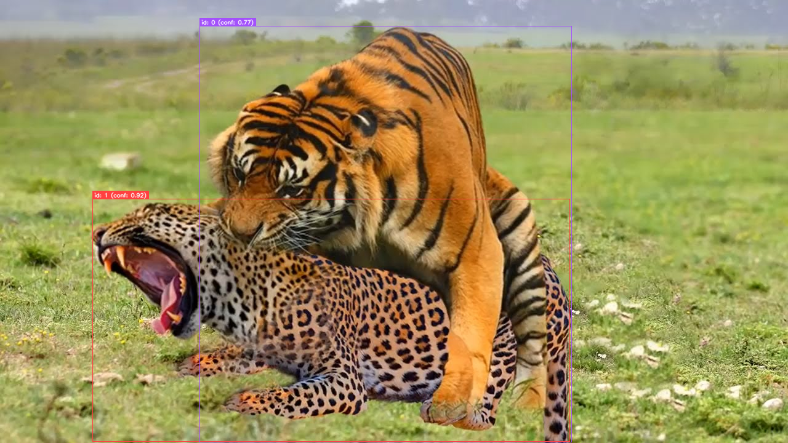
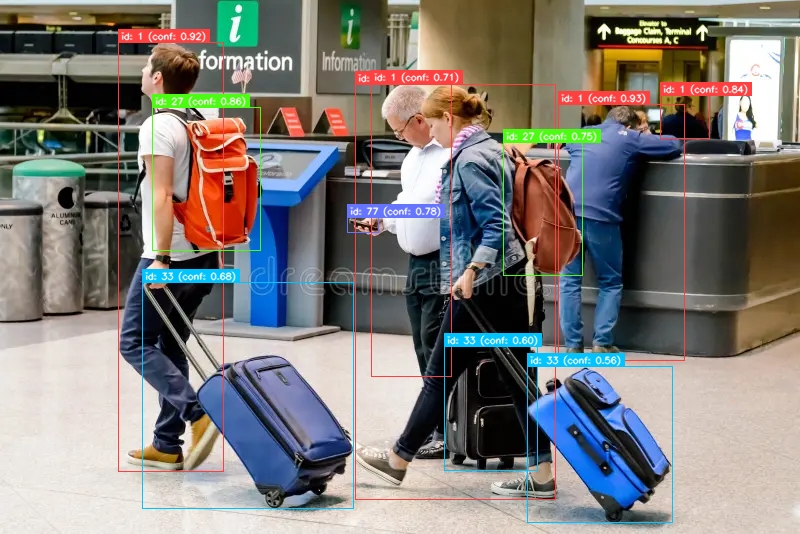

# Fine-Tune RF-DETR on Custom Classes from Open Images V7 dataset

> Want to use the latest [SOTA object detection models](https://github.com/roboflow/rf-detr) from Roboflow on custom classes? First, check if your classes exist in the [Open Images dataset](https://storage.googleapis.com/openimages/web/index.html). If they do, good news! This repo shows you how to fine-tune a RF-DETR model with a single command.

<p align="center">
  
  
</p>

Feel free to share any feedback, bugs, or improvement ideas!

## 📦 Requirements

- `uv` (Python package and project manager). If not, just run (on macOS and Linux):

```bash
curl -LsSf https://astral.sh/uv/install.sh | sh
```

- Python 3.10+. If not, just run:

```bash
uv python install 3.10.18
```

> Check [Astral documentation](https://docs.astral.sh/uv/getting-started/installation) if you need alternative installation methods.

## 🚀 Usage

### Quickstart

First, **select your target class(es)** from the 601 available in Open Images V7. View the set of boxable classes as a hierarchy [here](https://storage.googleapis.com/openimages/2018_04/bbox_labels_600_hierarchy_visualizer/circle.html), or explore the dataset visually using the [Open Images Bounding Boxes Explorer](https://storage.googleapis.com/openimages/web/visualizer/index.html?type=detection).

For example, to fine-tune RF-DETR on **Tiger** and **Cheetah** classes from Open Images V7:

```bash
uv run train.py \
  --target-classes tiger cheetah \
  --model base \
  --epochs 10 \
  --batch-size 8
```

This will:

- Download relevant annotations and images
- Convert them to COCO format
- Fine-tune RF-DETR on the selected subset
- Save logs and checkpoints

If you restart a training session, whether with the same or different classes, annotation files and already downloaded images will not be downloaded again.

### Using the fine-tuned model

Once your RF-DETR model is fine-tuned, you can run inference on a new image using the `infer.py` script:

```bash
uv run infer.py \
  --image path/to/my/image.png \
  --model base \
  --checkpoint path/to/my/checkoint.pth \
  --output output.png
```

This script takes a trained checkpoint, runs detection on a single image, and saves the annotated result.

### Advanced training settings

You can customize training with the following arguments:

| Argument                   | Description                                                                                 |
| -------------------------- | ------------------------------------------------------------------------------------------- |
| `--target-classes`         | **(Required)** One or more class names to fine-tune on (e.g., `tiger cheetah`)              |
| `--model`                  | Type of RFDETR model. Can be `nano`, `small`, `medium`, `base` or `large` (default: `base`) |
| `--epochs`                 | Number of training epochs (default: `20`)                                                   |
| `--learning-rate` / `--lr` | Learning rate (default: `1e-4`)                                                             |
| `--batch-size`             | Batch size. (default: `20`)                                                                 |
| `--grad-accum-steps`       | Gradient accumulation steps (default: `1`)                                                  |
| `--early-stopping`         | Early stepping (Add `--early-stopping` to enable it)                                        |

Other parameters or files will be downloaded or generated:

| Argument           | Description                                                                                                        |
| ------------------ | ------------------------------------------------------------------------------------------------------------------ |
| `--result-folder`  | Custom path to save results. If not set, a timestamped folder with class names is auto-created in `results` folder |
| `--dataset-folder` | Folder where the COCO-converted dataset will be stored (default: `dataset`)                                        |
| `--csv-folder`     | Folder where CSVs from Open Images will be saved (default: `OIDv7_csv`)                                            |
| `--manifest-path`  | Path to the Open Images V7 manifest JSON with links to the annotation files (default: `csv_manifest.txt`)          |

Alternatively, run:

```bash
uv run train.py -h
```

### Advanced inference settings

You can customize training with the following arguments:

| Argument       | Description                                                                              |
| -------------- | ---------------------------------------------------------------------------------------- |
| `--image`      | **(Required)** Path to the input image                                                   |
| `--model`      | **(Required)** Type of RFDETR model. Can be `nano`, `small`, `medium`, `base` or `large` |
| `--checkpoint` | **(Required)** Path to checkpoint .pth file                                              |
| `--output`     | Path to save annotated output image" (default: `detections.png`)                         |

Alternatively, run:

```bash
uv run infer.py -h
```

## 🧪 TODO

- [ ] Publish a Docker image to containerize the training phase

## 📜 License

This repo is licensed under a [MIT License](LICENSE).

Please note that OIDv7 annotations are licensed by Google LLC under [CC BY 4.0](https://creativecommons.org/licenses/by/4.0/) license. The images are listed as having a [CC BY 2.0](https://creativecommons.org/licenses/by/2.0/) license.

Also, RF-DETR is licensed under a [Apache 2.0](https://www.apache.org/licenses/LICENSE-2.0) license.

## 🙏 Acknowledgments

- This project builds on [RF-DETR](https://github.com/roboflow/rf-detr), a state-of-the-art, open-source object detection model developed and released by [Roboflow](https://roboflow.com/). Their work on detection models and dataset tools has been instrumental in making advanced vision systems more accessible.

- This project uses [uv](https://github.com/astral-sh/uv) by Astral — a blazing fast Python package manager and runtime that enables clean, reproducible environments without manual setup.
